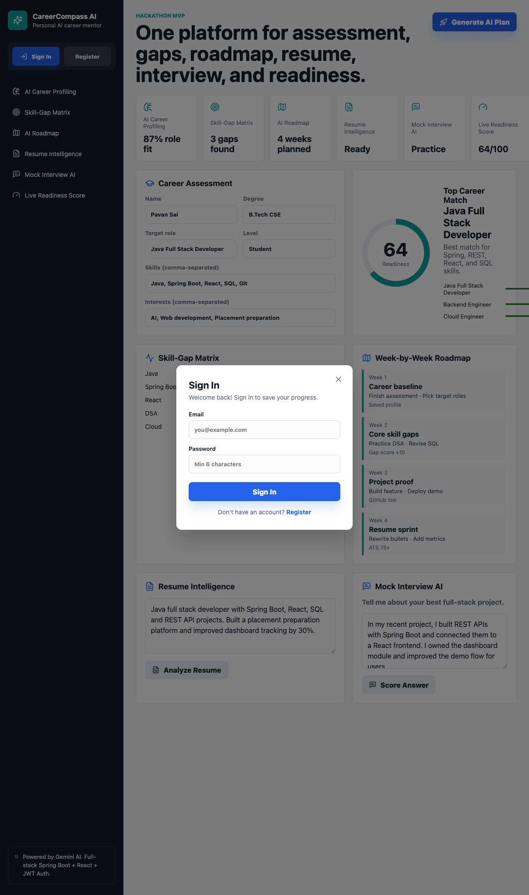

<p align="center">
  <picture>
    <source media="(prefers-color-scheme: dark)" srcset="https://img.shields.io/badge/CareerCompass-AI-0f9f9a?style=for-the-badge&logo=google&logoColor=white">
    
  </picture>
</p>

<h1 align="center">🚀 CareerCompass AI — Your AI-Powered Career Readiness Platform</h1>

<p align="center">
  <strong>One platform. Seven modules. AI-powered. 48-hour build.</strong>
  <br />
  <em>From fragmented placement prep to a unified, measurable readiness journey</em>
</p>

<p align="center">
  <a href="https://spring.io/projects/spring-boot"></a>
  <a href="https://react.dev"></a>
  <a href="https://vite.dev"></a>
  <a href="https://deepmind.google/technologies/gemini/"></a>
  <a href="https://www.postgresql.org"></a>
  <a href="https://www.java.com"></a>
  <br />
  <a href="LICENSE"></a>
  
  
</p>

---

## 📖 Table of Contents

- [Problem & Solution](#-problem--solution)
- [Features Overview](#-features-overview)
- [Screenshots](#-screenshots)
- [Technology Stack](#-technology-stack)
- [Architecture](#-architecture)
- [Quick Start](#-quick-start)
- [API Documentation](#-api-documentation)
- [Database Design](#-database-design)
- [AI Integration](#-ai-integration)
- [Security](#-security)
- [Testing](#-testing)
- [Deployment](#-deployment)
- [Project Structure](#-project-structure)
- [Hackathon Pitch](#-hackathon-pitch)
- [Team](#-team)

---

## 🎯 Problem & Solution

### The Problem
> **60% of engineering graduates struggle with employability** because placement preparation is fragmented across disconnected tools — resume builders, interview platforms, coding practice sites, and skill assessment platforms — with **no unified way to measure readiness**.

### Our Solution
> **CareerCompass AI** turns career readiness into one measurable journey:
> 1. 🧠 **Assess** — AI-powered career profiling based on your unique profile
> 2. 🎯 **Analyze** — Visual skill-gap matrix with prioritized recommendations
> 3. 🗺️ **Plan** — Personalized 8-12 week roadmap with proof-of-work milestones
> 4. 📄 **Polish** — Resume intelligence with ATS scoring and rewrite suggestions
> 5. 🎤 **Practice** — Mock interview coaching with STAR feedback
> 6. 📊 **Track** — Live readiness score tracking progress over time
> 7. 🛡️ **Scale** — Admin dashboard for cohort-level analytics

---

## ✨ Features Overview

| # | Module | Description | Powered By |
|---|--------|-------------|------------|
| 1 | **🧠 AI Career Profiling** | Role-fit scores based on skills, degree, and target role | Gemini AI |
| 2 | **🎯 Skill-Gap Matrix** | Visual heatmap of readiness across 9 core skills with priority levels | Gemini AI |
| 3 | **🗺️ AI Roadmap** | Week-by-week personalized career roadmap with actions & proof | Gemini AI |
| 4 | **📄 Resume Intelligence** | ATS scoring, content quality, impact metrics, and rewrite suggestions | Gemini AI |
| 5 | **🎤 Mock Interview AI** | STAR-method scoring with coaching feedback and improved answers | Gemini AI |
| 6 | **📊 Live Readiness Score** | Animated score ring with real-time readiness tracking | Gemini AI |
| 7 | **🛡️ Admin Dashboard** | Cohort analytics, user management, and usage statistics | — |

### 🔧 Additional Features
- **🔐 JWT Authentication** — Secure sign-up/sign-in with BCrypt password hashing
- **🎯 Demo Mode** — One-click pre-fill for instant judges' walkthrough
- **📂 File Upload** — Upload .txt, .pdf, .doc, .docx for resume analysis
- **⚡ Intelligent Fallback** — Works without Gemini API key using smart mock logic
- **🐳 Docker Deploy** — One-command startup with PostgreSQL
- **☁️ Cloud Ready** — Deploy to Railway with auto-detected Spring Boot + PostgreSQL

---

## 📸 Screenshots

<p align="center">
  <em>Screenshots from the CareerCompass AI application interface. See the <code>screenshots/</code> directory.</em>
</p>

<p align="center">
  
  <br />
  <em>Dashboard — Career assessment, skill gaps, roadmap, resume analysis, and interview coaching in one unified view</em>
</p>

<p align="center">
  
  <br />
  <em>Authentication — Sign in or create an account with JWT-based authentication</em>
</p>

<p align="center">
  
  <br />
  <em>AI Career Plan — Personalized readiness score, role matches, and skill-gap analysis with animated ring visualization</em>
</p>

<p align="center">
  
  <br />
  <em>Skill-Gap Matrix — Color-coded heatmap showing readiness across 9 core skills with priority classification</em>
</p>

<p align="center">
  
  <br />
  <em>AI Roadmap — Week-by-week personalized career roadmap with actions and proof-of-work milestones</em>
</p>

<p align="center">
  
  <br />
  <em>Resume Intelligence — Three-dimensional scoring (ATS, Content, Impact) with actionable rewrite suggestions</em>
</p>

<p align="center">
  
  <br />
  <em>Mock Interview AI — STAR-method scoring with coaching feedback and improved answer generation</em>
</p>

<p align="center">
  
  <br />
  <em>Admin Dashboard — Cohort readiness analytics with user management and usage statistics</em>
</p>

---

## 🛠️ Technology Stack

| Layer | Technology | Purpose |
|-------|------------|---------|
| **Frontend** | React 19 + Vite 7 | Modern, fast UI framework and build tool |
| | Lucide React | Lightweight icon library |
| | CSS (Custom) | Responsive design with CSS custom properties |
| **Backend** | Java 21 | Latest LTS with records, pattern matching |
| | Spring Boot 3.5 | Production-grade REST API framework |
| | Spring Security | Authentication, CORS, CSRF protection |
| | Spring Data JPA | Database access and ORM |
| | Spring WebFlux | WebClient for Gemini API calls |
| **AI** | Google Gemini 2.0 Flash | Structured prompt-based analysis |
| **Auth** | JWT (HMAC-SHA256) | Stateless token authentication |
| | BCrypt | Password hashing with salt |
| **Database** | H2 (Dev) / PostgreSQL (Prod) | Dual-mode database configuration |
| **DevOps** | Docker + Docker Compose | Containerized deployment |
| | Maven | Java build and dependency management |
| | npm | JavaScript package management |

---

## 🏗️ Architecture

```
┌─────────────────────────────────────────────────────────────────────────────┐
│                         User (Browser)                                      │
└───────────────────────────┬─────────────────────────────────────────────────┘
                            │ HTTP / JWT Bearer Token
                            ▼
┌─────────────────────────────────────────────────────────────────────────────┐
│                     React + Vite Frontend (Port 5173)                        │
│  ┌──────────┐ ┌──────────┐ ┌──────────┐ ┌──────────┐ ┌──────────────────┐  │
│  │Dashboard │ │Career    │ │Skill-Gap │ │AI        │ │Resume            │  │
│  │          │ │Profiling │ │Matrix    │ │Roadmap   │ │Intelligence      │  │
│  └──────────┘ └──────────┘ └──────────┘ └──────────┘ └──────────────────┘  │
│  ┌──────────────────┐ ┌──────────────────┐ ┌───────────────────────────┐   │
│  │Mock Interview AI │ │Live Readiness    │ │Admin Dashboard            │   │
│  └──────────────────┘ └──────────────────┘ └───────────────────────────┘   │
└───────────────────────────┬─────────────────────────────────────────────────┘
                            │ REST API
                            ▼
┌─────────────────────────────────────────────────────────────────────────────┐
│                     Spring Boot Backend (Port 8080)                          │
│  ┌──────────────┐ ┌──────────────┐ ┌──────────────────┐ ┌──────────────┐   │
│  │  Controllers │ │   Services   │ │  Security Layer  │ │  Gemini      │   │
│  │  Auth        │ │  AuthService │ │  CORS Config     │ │  Service     │   │
│  │  Career      │ │  CareerAi    │ │  JWT Filter      │ │  WebClient   │   │
│  │  Admin       │ │  Service     │ │  Exception       │ │  Prompts     │   │
│  └──────────────┘ └──────────────┘ │  Handler         │ └──────────────┘   │
│                                     └──────────────────┘                    │
│  ┌──────────────────────────────────────────────────────────────────────┐  │
│  │              JPA Repositories (Spring Data)                           │  │
│  │  UserRepo · CareerPlanRepo · ResumeRepo · InterviewRepo              │  │
│  └──────────────────────────────────────────────────────────────────────┘  │
└──────────────────────┬──────────────────────────────────┬──────────────────┘
                       │ JPA / JDBC                        │ REST
                       ▼                                   ▼
┌──────────────────────────────┐          ┌──────────────────────────────┐
│  Database (H2/PostgreSQL)    │          │  Google Gemini 2.0 Flash     │
│  ┌────────┐ ┌─────────────┐ │          │  ┌────────────────────────┐  │
│  │ users  │ │career_plans │ │          │  │ Career Coach Prompt    │  │
│  ├────────┤ ├─────────────┤ │          │  │ ATS Reviewer Prompt    │  │
│  │resume_ │ │interview_   │ │          │  │ Interview Coach Prompt │  │
│  │analyses│ │feedbacks    │ │          │  └────────────────────────┘  │
│  └────────┘ └─────────────┘ │          └──────────────────────────────┘
└──────────────────────────────┘
```

### Data Flow Diagram

```
User Input → Frontend Form → POST /api/career-plan
    → CareerController
    → CareerAiService.buildPlan()
    → GeminiService.isAvailable()?
        YES → WebClient → Gemini API → Parse JSON
        NO  → mockCareerPlan() (intelligent fallback)
    → Persist to career_plans table
    → Return CareerPlanResponse → Frontend → Render Dashboard
```

---

## 🚀 Quick Start

### Prerequisites

| Tool | Version | Installation |
|------|---------|-------------|
| Java | 21+ | [Download](https://adoptium.net) |
| Node.js | 20+ | [Download](https://nodejs.org) |
| Maven | 3.9+ | [Download](https://maven.apache.org) |
| Docker (optional) | Latest | [Download](https://docker.com) |

### 1. Clone & Setup

```bash
git clone https://github.com/Pavan3030-pr/CarrerAi.git
cd CarrerAi

# Copy environment template (Gemini API key is optional — demo works without it)
cp .env.example .env
# Edit .env if you have a Gemini API key
```

### 2. Start Backend

```bash
cd backend
mvn spring-boot:run
```

The backend starts on [http://localhost:8080](http://localhost:8080).  
Verify with: `curl http://localhost:8080/api/health`

### 3. Start Frontend

```bash
cd frontend
npm install
npm run dev
```

The frontend starts on [http://localhost:5173](http://localhost:5173).

### 4. Open the App

Visit [http://localhost:5173](http://localhost:5173) → Click **🎯 Demo Mode** → Click **Generate AI Plan** → Explore!

### Docker (Alternative)

```bash
docker compose up --build
```

Starts all services: PostgreSQL on port 5432, Backend on 8080, Frontend on 5173.

---

## 🔌 API Documentation

### Overview

Base URL: `http://localhost:8080/api`

All requests/responses use `Content-Type: application/json`.  
Authentication via `Authorization: Bearer <token>` header (optional for career endpoints).

### Health Check

```http
GET /api/health
→ "CareerCompass AI backend is running"
```

### Authentication Endpoints

#### Register
```http
POST /api/auth/register
{
  "name": "Pavan Sai",
  "email": "pavan@example.com",
  "password": "securepassword"
}
→ {
  "token": "eyJhbGciOiJIUzI1NiJ9...",
  "name": "Pavan Sai",
  "email": "pavan@example.com"
}
```

#### Login
```http
POST /api/auth/login
{
  "name": "Pavan Sai",
  "email": "pavan@example.com",
  "password": "securepassword"
}
→ {
  "token": "eyJhbGciOiJIUzI1NiJ9...",
  "name": "Pavan Sai",
  "email": "pavan@example.com"
}
```

### Career Endpoints

#### Generate Career Plan
```http
POST /api/career-plan
{
  "name": "Pavan Sai",
  "degree": "B.Tech CSE",
  "targetRole": "Java Full Stack Developer",
  "experienceLevel": "Student",
  "skills": ["Java", "Spring Boot", "React", "SQL", "Git"],
  "interests": ["AI", "Web development"]
}
→ {
  "readinessScore": 64,
  "careerMatches": [
    { "role": "Java Full Stack Developer", "fit": 87, "reason": "Best match for Spring, REST, React, and SQL skills." }
  ],
  "skillGaps": [
    { "skill": "Cloud", "readiness": 46, "priority": "Critical", "recommendation": "Build one mini-project..." }
  ],
  "roadmap": [
    { "week": 1, "focus": "Career baseline for Java Full Stack Developer", "actions": [...], "proofOfWork": "..." }
  ],
  "nextActions": [...]
}
```

#### Analyze Resume
```http
POST /api/resume/analyze
{
  "targetRole": "Java Full Stack Developer",
  "resumeText": "Experienced Java developer with Spring Boot, React, SQL..."
}
→ {
  "atsScore": 78,
  "contentScore": 82,
  "impactScore": 74,
  "strengths": [...],
  "fixes": [...],
  "rewriteSuggestions": [...]
}
```

#### Score Interview Answer
```http
POST /api/interview/score
{
  "targetRole": "Java Full Stack Developer",
  "question": "Tell me about your best full-stack project.",
  "answer": "In my recent project, I built REST APIs with Spring Boot..."
}
→ {
  "score": 71,
  "question": "Tell me about your best full-stack project.",
  "verdict": "Strong answer. Add one sharper metric...",
  "coachingTips": ["Open with context...", "Show your exact contribution..."],
  "improvedAnswer": "In my recent project, I owned the backend API flow..."
}
```

### Admin Endpoints

```http
GET /api/admin/users
→ [{ "id": 1, "name": "Pavan Sai", "email": "pavan@example.com", "createdAt": "..." }]

GET /api/admin/analytics/overview
→ {
  "totalUsers": 5,
  "totalCareerPlans": 12,
  "totalResumeAnalyses": 8,
  "totalInterviewFeedbacks": 6,
  "averageReadinessScore": 64,
  "averageInterviewScore": 71,
  "recentSignups7Days": 3
}
```

### Error Responses

All errors return structured JSON:
```json
{ "error": "Human-readable error message" }
```

| Status Code | Meaning |
|-------------|---------|
| 200 | Success |
| 400 | Bad Request (validation error, duplicate email, invalid credentials) |
| 500 | Internal Server Error |

---

## 🗄️ Database Design

### Entity Relationship

```
┌──────────────┐       ┌──────────────────┐
│    users     │       │  career_plans    │
│──────────────│       │──────────────────│
│ id (PK)      │──1──*│ user_email (FK)  │
│ name         │       │ readiness_score  │
│ email (UQ)   │       │ plan_data (JSON) │
│ password_hash│       │ created_at       │
│ created_at   │       └──────────────────┘
└──────────────┘
       │
       │ 1
       │ *
       ├────────────────┐
       │                │
┌──────────────┐  ┌──────────────────┐
│resume_       │  │ interview_       │
│analyses      │  │ feedbacks        │
│──────────────│  │──────────────────│
│ id (PK)      │  │ id (PK)          │
│ user_email   │  │ user_email       │
│ ats_score    │  │ score            │
│ content_score│  │ feedback_data    │
│ impact_score │  │ created_at       │
│ analysis_data│  └──────────────────┘
│ created_at   │
└──────────────┘
```

### Design Decisions
- **H2 for dev, PostgreSQL for production** — switched via env vars
- **JSON columns** for flexible plan/analysis/feedback data
- **DDL auto-update** — `spring.jpa.hibernate.ddl-auto=update`
- **Email as foreign key** — human-readable, easy debugging

---

## 🧠 AI Integration

### Architecture

```
CareerAiService → GeminiService → WebClient → Google Gemini 2.0 Flash API
      ↓                  ↓
  Fallback to        Structured Prompt Templates
  intelligent mock    (Career Coach, ATS Reviewer, Interview Coach)
```

### Prompt Templates

Three specialized prompts, each with system instruction enforcing JSON output structure:

1. **Career Planning** — Role matching, skill gap analysis, roadmap generation
2. **Resume Analysis** — ATS scoring, content quality assessment, rewrite suggestions
3. **Interview Coaching** — STAR method evaluation, coaching tips, improved answers

### Fallback Strategy

When `GEMINI_API_KEY` is absent or the API call fails:
```java
if (gemini.isAvailable()) {
    try { /* Real Gemini API call */ }
    catch (Exception e) { /* Intelligent mock fallback */ }
} else {
    /* Intelligent mock fallback using keyword matching + scoring logic */
}
```

The mock fallback uses real analysis logic — keyword matching, length analysis, structure detection — providing meaningful responses even without AI.

### Configuration

```env
GEMINI_API_KEY=your_api_key_here    # Optional — demo works without it
```

- **Model:** Gemini 2.0 Flash
- **Temperature:** 0.4 (consistent, deterministic outputs)
- **Max tokens:** 2048

---

## 🔒 Security

| Feature | Implementation |
|---------|----------------|
| **Password Hashing** | BCrypt with automatic salt (Spring Security) |
| **JWT Tokens** | HMAC-SHA256 signed, 24-hour expiry |
| **CORS** | Configurable allowed origins (environment variable) |
| **CSRF** | Disabled for stateless API architecture |
| **Input Validation** | `@Valid` annotations on all DTOs with field-level error messages |
| **Error Handling** | Global exception handler — no stack traces or internals leaked |
| **XSS Protection** | React auto-escapes all output |
| **SQL Injection** | Prevented by Spring Data JPA parameterized queries |

---

## 🧪 Testing

### Backend Tests: 28/28 Passing

| Test Suite | Count | What It Tests |
|------------|-------|---------------|
| `AuthServiceTest` | 10 | Registration, login, duplicate email, invalid credentials, email normalization |
| `CareerAiServiceTest` | 18 | Career plan generation, resume analysis, interview scoring, edge cases |

**Framework:** JUnit 5 + Mockito  
**Coverage:** All service methods with mocked dependencies

```bash
cd backend && mvn test
# Results: Tests run: 28, Failures: 0, Errors: 0
```

### Frontend Build

```bash
cd frontend && npm run build
# ✓ Built in ~680ms, 1573 modules
```

---

## ☁️ Deployment

### Docker (Local)

```bash
docker compose up --build
```

| Service | Port | Description |
|---------|------|-------------|
| `db` | 5432 | PostgreSQL 16 |
| `backend` | 8080 | Spring Boot API |
| `frontend` | 5173 | React + Vite served via Nginx |

### Railway (Cloud)

Deploy the full stack with PostgreSQL:

1. Create account at [Railway.app](https://railway.app)
2. Click **+ New → Database → PostgreSQL**
3. Click **+ New → GitHub Repo → Select `CarrerAi`**
4. Railway auto-detects Spring Boot from `pom.xml`
5. Add environment variables:
   - `GEMINI_API_KEY` — (optional)
   - `CORS_ALLOWED_ORIGINS` — Your frontend URL
   - `JWT_SECRET` — Random secret string
6. PostgreSQL `DATABASE_URL` auto-connected
7. Deploy!

### Environment Variables

```env
# Required
PORT=8080
CORS_ALLOWED_ORIGINS=http://localhost:5173,http://localhost:3000

# Database (H2 by default, PostgreSQL via env)
DATABASE_URL=jdbc:postgresql://host:5432/careercompass
JDBC_DATABASE_DRIVER=org.postgresql.Driver
JDBC_DATABASE_USERNAME=careercompass
JDBC_DATABASE_PASSWORD=secure_password
JPA_DIALECT=org.hibernate.dialect.PostgreSQLDialect

# AI (optional — demo works without it)
GEMINI_API_KEY=your_gemini_api_key

# Auth
JWT_SECRET=your_random_secret_key
```

---

## 📁 Project Structure

```
CarrerAi/
├── frontend/                          # React + Vite Dashboard
│   ├── src/
│   │   ├── main.jsx                  # App entry: auth, 7 modules, admin dashboard
│   │   └── styles.css                # Complete responsive styling (400+ lines)
│   ├── index.html
│   ├── package.json
│   └── vite.config.js
├── backend/                           # Spring Boot REST API
│   ├── src/main/java/com/carrerai/
│   │   ├── config/                    # Security, JWT filter, exception handler
│   │   │   ├── SecurityConfig.java
│   │   │   ├── JwtAuthFilter.java
│   │   │   └── GlobalExceptionHandler.java
│   │   ├── controller/               # REST endpoints
│   │   │   ├── AuthController.java
│   │   │   ├── CareerController.java
│   │   │   └── AdminController.java
│   │   ├── dto/                      # Request/response data transfer objects
│   │   ├── model/                    # Domain models + JPA entities
│   │   ├── repository/               # Spring Data JPA repositories
│   │   ├── service/                  # Business logic
│   │   │   ├── AuthService.java
│   │   │   ├── CareerAiService.java
│   │   │   └── GeminiService.java
│   │   └── util/                     # JWT utility
│   ├── src/test/java/                # 28 unit tests
│   ├── pom.xml
│   └── Dockerfile
├── docs/                              # Documentation
│   ├── TECHNICAL_DOCUMENTATION.md
│   ├── architecture-diagram.svg
│   ├── api-documentation.md
│   └── deployment-guide.md
├── demo/                              # Demo assets
│   ├── demo-script.md                # 3/5/10 minute walkthrough scripts
│   └── demo-video-guide.md           # Video recording guide
├── screenshots/                       # App screenshots (8 PNGs)
├── submission/                        # Submission package
│   └── final-submission-checklist.md
├── docker-compose.yml                 # PostgreSQL + Backend + Frontend
├── railway.json                       # Railway deployment config
├── .env.example                       # Environment variables template
└── README.md                          # This file
```

---

## 🏆 Hackathon Pitch

> **60% of graduates struggle with employability** because preparation is fragmented, generic, and hard to measure.
>
> **CareerCompass AI** turns career readiness into one measurable journey:
> - 🧠 **AI-powered assessment** that understands your unique profile
> - 🎯 **Visual skill-gap matrix** with prioritization
> - 🗺️ **Personalized 8-12 week roadmap** to job readiness
> - 📄 **Resume intelligence** with ATS optimization
> - 🎤 **Mock interview coaching** with STAR feedback
> - 📊 **Live readiness score** tracking progress
>
> **Built in 48 hours** with Java 21, Spring Boot 3.5, React 19, and Google Gemini AI.
> **Database-backed** with JPA (H2/PostgreSQL), JWT-secured with BCrypt.
> **Dockerized** and **cloud-ready** for Railway deployment.

---

## 🔮 Future Scope

| Enhancement | Status | Impact |
|-------------|--------|--------|
| Real Gemini API with streaming | 🔜 Planned | Better AI responses |
| PostgreSQL in production | ✅ Ready | Via env var config |
| College admin dashboard | 🔜 Planned | Cohort analytics |
| Mobile app (React Native) | 💡 Idea | Accessibility |
| Multilingual mentoring | 💡 Idea | Regional language support |
| Placement tracker pipeline | 🔜 Planned | Application tracking |
| Email notifications | 💡 Idea | User engagement |

---

## 👥 Team

| Role | Name |
|------|------|
| **Full-Stack Developer & AI Integration** | Pavan Sai |
| **UI/UX Design** | Pavan Sai |

---

## 📄 License

This project is licensed under the MIT License — see the [LICENSE](LICENSE) file for details.

---

<p align="center">
  Made with ❤️ for the hackathon
  <br />
  <a href="https://github.com/Pavan3030-pr/CarrerAi">
    
  </a>
  <br />
  <sub>Built in 48 hours · Java 21 · Spring Boot 3.5 · React 19 · Gemini AI · PostgreSQL</sub>
</p>
