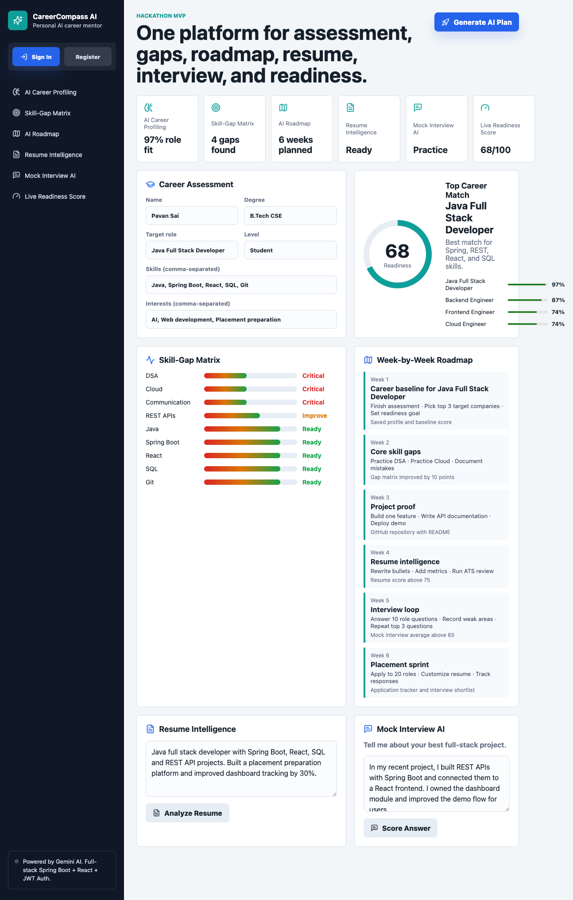
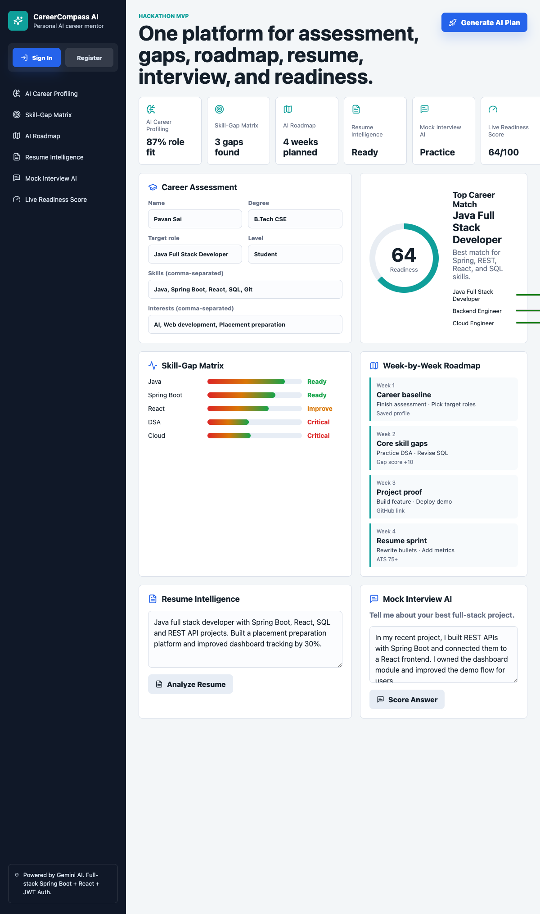

# 🚀 CareerCompass AI — Your AI-Powered Career Readiness Platform

[](https://spring.io/projects/spring-boot)
[](https://reactjs.org/)
[](https://deepmind.google/technologies/gemini/)
[](LICENSE)

**CareerCompass AI** is a hackathon-ready career readiness platform that replaces fragmented placement-prep tools with one unified workflow: **career assessment → skill-gap analysis → AI roadmap → resume intelligence → mock interview feedback → live readiness score**.

> 📊 **The Problem:** 60% of engineering graduates struggle with employability because preparation is fragmented, generic, and hard to measure.
>
> 🎯 **Our Solution:** Turn career readiness into one measurable journey with AI-powered insights and a clear 8-12 week path to job readiness.

---

## 📸 Screenshots

<p align="center">
  
  <br/>
  <em>Dashboard — Career assessment, skill gaps, roadmap, resume analysis, and interview coaching in one view</em>
</p>

<p align="center">
  
  <br/>
  <em>Authentication — Sign in or create an account with JWT-based auth</em>
</p>

<p align="center">
  
  <br/>
  <em>AI-Powered Career Plan — Personalized readiness score, role matches, and skill-gap analysis</em>
</p>

<p align="center">
  
  <br/>
  <em>Resume Intelligence — ATS scoring with actionable rewrite suggestions</em>
</p>

<p align="center">
  
  <br/>
  <em>Mock Interview AI — STAR-based scoring with coaching tips and improved answer suggestions</em>
</p>

---

## ✨ Core Features

| Module | Description |
|--------|-------------|
| 🧠 **AI Career Profiling** | Role-fit scores based on your skills, degree, and target role |
| 🎯 **Skill-Gap Matrix** | Visual heatmap of readiness across core skills with priorities |
| 🗺️ **AI Roadmap** | Week-by-week personalized career roadmap with proof-of-work milestones |
| 📄 **Resume Intelligence** | ATS scoring, content quality, impact metrics, and rewrite suggestions |
| 🎤 **Mock Interview AI** | STAR-method scoring with coaching feedback and improved answers |
| 📊 **Live Readiness Score** | Real-time placement readiness tracking with progress visualization |

## 🏗️ Architecture

```
┌─────────────────────┐      ┌─────────────────────┐      ┌─────────────────┐
│                     │      │                     │      │                 │
│   React + Vite     │◄────►│  Spring Boot REST   │◄────►│   Google Gemini │
│   Frontend (5173)  │ HTTP │  Backend (8080)      │ REST │   AI API        │
│                     │ JWT  │                     │      │                 │
└─────────────────────┘      └─────────────────────┘      └─────────────────┘
        │                            │
        │ localStorage               │ In-Memory Map
        │ (JWT Token)                │ (User Store)
        │                            │
┌─────────────────────┐      ┌─────────────────────┐
│   Auth Flow:        │      │   Auth Flow:        │
│   - Login/Register  │      │   - JWT Generation  │
│   - Token Storage   │      │   - Password Hashing │
│   - Bearer Header   │      │   - Email Normalize │
└─────────────────────┘      └─────────────────────┘
```

### Tech Stack

| Layer | Technology |
|-------|-----------|
| **Frontend** | React 19, Vite 7, Lucide React icons |
| **Backend** | Java 21, Spring Boot 3.5, Spring Security |
| **AI** | Google Gemini 2.0 Flash API (with mock fallback) |
| **Auth** | JWT (HMAC-SHA256), BCrypt password hashing |
| **Database** | In-memory (ConcurrentHashMap) — ready for PostgreSQL |
| **Container** | Docker, Docker Compose |
| **Build** | Maven, npm |

## 🚀 Quick Start

### Prerequisites

- Java 21+
- Node.js 20+
- Maven 3.9+
- (Optional) Google Gemini API key for AI features

### 1. Clone & Setup

```bash
git clone https://github.com/Pavan3030-pr/CarrerAi.git
cd CarrerAi

# Copy environment template
cp .env.example .env
# Edit .env and add your Gemini API key (optional — demo works without it)
```

### 2. Start Backend

```bash
cd backend
mvn spring-boot:run
```

The backend starts on [http://localhost:8080](http://localhost:8080).

### 3. Start Frontend

```bash
cd frontend
npm install
npm run dev
```

The frontend starts on [http://localhost:5173](http://localhost:5173).

### 4. Open the App

Visit [http://localhost:5173](http://localhost:5173) in your browser.

### Docker (Alternative)

```bash
docker compose up --build
```

This starts both services — frontend on port 5173, backend on port 8080.

## 🔌 API Reference

### Health Check

```http
GET /api/health
→ "CareerCompass AI backend is running"
```

### Authentication

```http
POST /api/auth/register
Content-Type: application/json

{
  "name": "Pavan Sai",
  "email": "pavan@example.com",
  "password": "securepassword"
}

→ {
  "token": "eyJhbGciOiJIUzI1NiJ9...",
  "name": "Pavan Sai",
  "email": "pavan@example.com"
}
```

```http
POST /api/auth/login
Content-Type: application/json

{
  "name": "Pavan Sai",
  "email": "pavan@example.com",
  "password": "securepassword"
}

→ {
  "token": "eyJhbGciOiJIUzI1NiJ9...",
  "name": "Pavan Sai",
  "email": "pavan@example.com"
}
```

### Career Plan

```http
POST /api/career-plan
Content-Type: application/json

{
  "name": "Pavan Sai",
  "degree": "B.Tech CSE",
  "targetRole": "Java Full Stack Developer",
  "experienceLevel": "Student",
  "skills": ["Java", "Spring Boot", "React", "SQL", "Git"],
  "interests": ["AI", "Web development", "Placement preparation"]
}

→ {
  "readinessScore": 64,
  "careerMatches": [...],
  "skillGaps": [...],
  "roadmap": [...],
  "nextActions": [...]
}
```

### Resume Analysis

```http
POST /api/resume/analyze
Content-Type: application/json

{
  "targetRole": "Java Full Stack Developer",
  "resumeText": "Experienced Java developer with Spring Boot, React, SQL..."
}

→ {
  "atsScore": 78,
  "contentScore": 82,
  "impactScore": 74,
  "strengths": [...],
  "fixes": [...],
  "rewriteSuggestions": [...]
}
```

### Mock Interview

```http
POST /api/interview/score
Content-Type: application/json

{
  "targetRole": "Java Full Stack Developer",
  "question": "Tell me about your best full-stack project.",
  "answer": "In my recent project, I built REST APIs with Spring Boot..."
}

→ {
  "score": 71,
  "question": "Tell me about your best full-stack project.",
  "verdict": "Strong answer...",
  "coachingTips": [...],
  "improvedAnswer": "..."
}
```

## 🧪 Running Tests

```bash
# Backend tests (30 tests)
cd backend && mvn test

# Frontend build check
cd frontend && npm run build
```

## 🧠 AI Integration

CareerCompass AI integrates with **Google Gemini 2.0 Flash** for intelligent analysis:

- **Career Planning** — Role matching, skill gap analysis, and roadmap generation
- **Resume Analysis** — ATS scoring and content improvement suggestions
- **Interview Coaching** — STAR method evaluation with personalized feedback

**No API key? No problem.** The app automatically falls back to intelligent mock analysis when no Gemini API key is configured.

### Setting up Gemini

1. Get an API key from [Google AI Studio](https://aistudio.google.com/)
2. Add it to your `.env` file:
   ```
   GEMINI_API_KEY=your_api_key_here
   ```

## 🔒 Security

- **JWT Authentication** — HMAC-SHA256 signed tokens with 24-hour expiry
- **Password Security** — BCrypt hashing (no plaintext storage)
- **Email Normalization** — Case-insensitive email matching
- **CORS** — Configurable allowed origins
- **Error Handling** — Global exception handler with JSON error responses

## 📁 Project Structure

```
CarrerAi/
├── frontend/                    # React + Vite dashboard
│   ├── src/
│   │   ├── main.jsx            # App entry, auth, career modules
│   │   └── styles.css          # Complete styling
│   ├── index.html
│   ├── package.json
│   └── Dockerfile
├── backend/                     # Spring Boot REST API
│   ├── src/main/java/com/carrerai/
│   │   ├── config/             # Security, JWT filter, exception handler
│   │   ├── controller/         # Auth & Career REST controllers
│   │   ├── dto/                # Request/response DTOs
│   │   ├── model/              # Domain models
│   │   ├── service/            # Auth, Career AI, Gemini services
│   │   └── util/               # JWT utility
│   ├── src/test/java/           # 30 comprehensive tests
│   ├── pom.xml
│   └── Dockerfile
├── screenshots/                 # App screenshots
├── docker-compose.yml
├── .env.example
└── README.md
```

## 🏆 Hackathon Pitch

> **60% of graduates struggle with employability** because preparation is fragmented, generic, and hard to measure.
>
> **CareerCompass AI** turns career readiness into one measurable journey:
> - 🧠 AI-powered assessment that understands your unique profile
> - 🎯 Visual skill-gap matrix with prioritization
> - 🗺️ Personalized 8-12 week roadmap to job readiness
> - 📄 Resume intelligence with ATS optimization
> - 🎤 Mock interview coaching with STAR feedback
> - 📊 Live readiness score tracking progress
>
> **Built in 48 hours** with Java, Spring Boot, React, and Google Gemini AI.

## 🔮 Future Scope

- [ ] **PostgreSQL persistence** for users, assessments, and progress history
- [ ] **College admin dashboard** for cohort readiness analytics
- [ ] **Mobile app** with push notifications and offline mode
- [ ] **Multilingual mentoring** in regional Indian languages
- [ ] **Real Gemini API client** with prompt templates and JSON response parsing
- [ ] **Social features** — peer reviews, group roadmaps
- [ ] **Placement tracker** — application pipeline with status tracking

## 🤝 Contributing

This is a hackathon project! Feel free to fork, open issues, or submit PRs.

---

<p align="center">
  Made with ❤️ for the hackathon<br/>
  <a href="https://github.com/Pavan3030-pr/CarrerAi">GitHub Repository</a>
</p>
